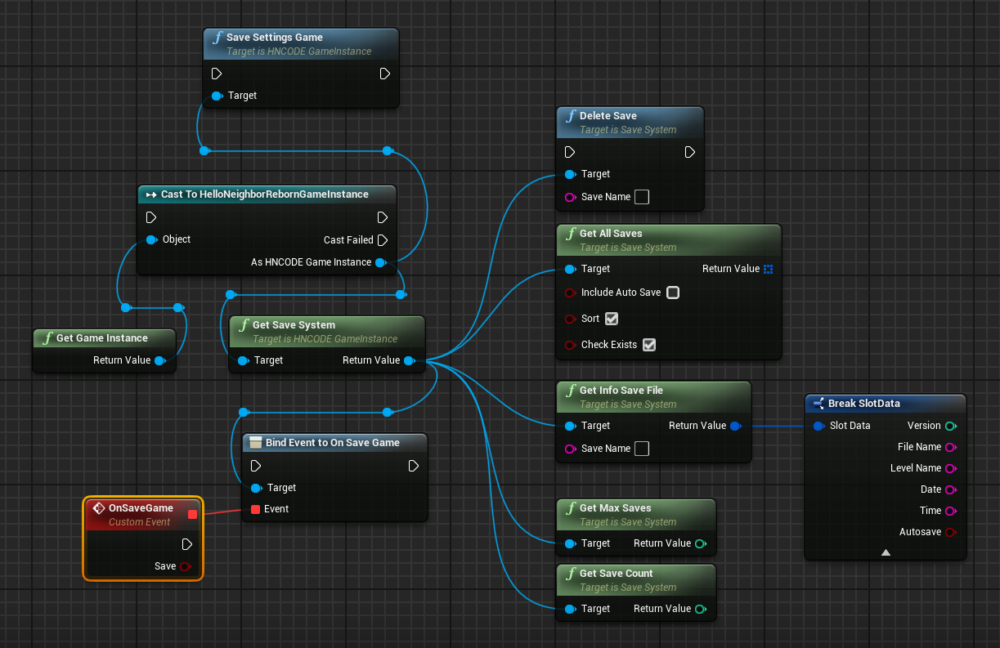
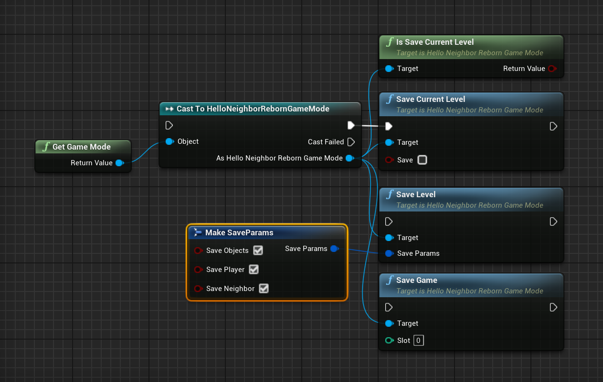
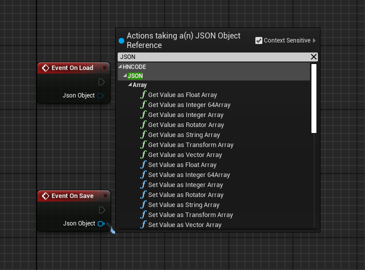

# ShatalovSaves

> For Unreal Engine 4.27 (and i think higher versions).

Although this save system wasn't created by [**Anton Shatalov**](https://dev.epicgames.com/community/profile/bL9nq/BingoBongo), I'll still name the project after him to honor the "Shatalov" series of projects.

Perhaps the original developers were Igor Belov and one of the tinyBuild programmers.

## Features

> Everything is the same as in the mod kit.

- GameInstance with `SaveSystem` singleton `GetSaveSystem()`.
- GameMode with SaveGame/SaveLevel functions.
- `USaveSystem` class
- `URecoveryData` class
- Base logic for saving/loading FlatActor's.
- Delegate for saving event.
- Events for FlatActor to load saves value and save.

| | |
|:-:|:-:|
 |  |

     
    FlatActor OnLoad/OnSave

